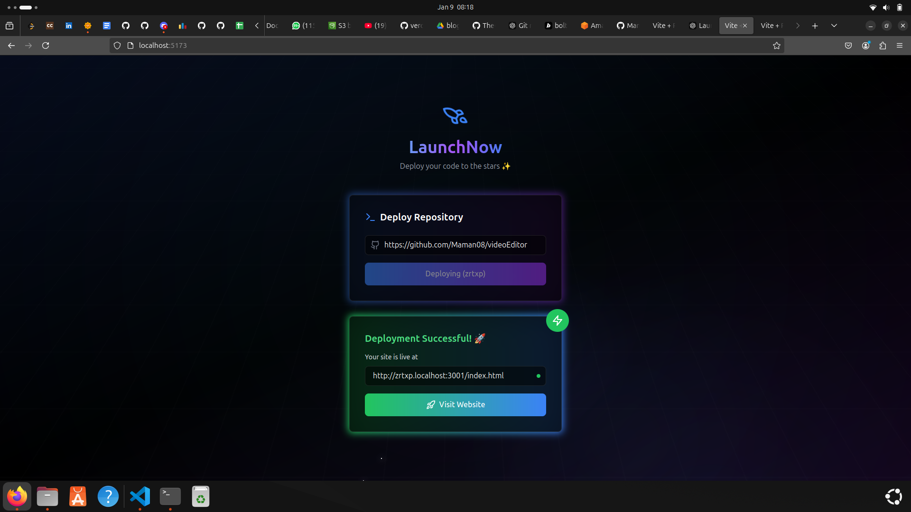

# LaunchNow





## Overview
This project is a simplified deployment platform that allows users to deploy their frontend projects seamlessly. It replicates key functionalities of platforms like Vercel by automating the process of building and hosting frontend code.

### Features:
- **User-friendly deployment process:** Users provide a repository URL, and the system handles the rest.
- **Integration with AWS S3:** Code is stored and retrieved from S3 for processing and deployment.
- **Automated build and deploy:** The deploy service builds the frontend code and serves the final output.
- **Polling mechanism:** Users can check the status of their deployment (e.g., Uploaded, Deployed) using a polling API.
- **Redis queue for task management:** Ensures efficient task processing and status updates.

## Architecture

### Workflow:
1. **User Interaction:**
   - Users enter the repository URL of the project they want to deploy.
   - The frontend sends this request to the request handler service.

2. **Code Storage:**
   - The request handler retrieves the code from the repository and stores it in AWS S3.

3. **Redis Queue:**
   - Once the code is uploaded, a task is added to a Redis queue.

4. **Deployment Service:**
   - The deploy service fetches the code from S3, builds it using a code build process, and generates static files (HTML, CSS, JS).
   - The generated static files are stored back in S3 for hosting.

5. **Polling for Status:**
   - Users can poll for the deployment status using a status endpoint.
   - Statuses include:
     - `Uploaded`
     - `Deployed`

6. **Final Deployment:**
   - Once deployed, the final URL for the project is returned (e.g., `http://id.localhost:30001/index.html`).

### Services:
1. **Upload Service:** Handles retrieving the repository code and uploading it to S3.
2. **Deploy Service:** Builds the frontend code and prepares it for deployment.
3. **Request Handler:** Manages user requests, interacts with Redis for task queueing, and handles status polling.

### Technology Stack:
- **Frontend:** React.js
- **Backend:** Node.js (Express.js)
- **Language:** TypeScript
- **Storage:** AWS S3
- **Queue Management:** Redis
- **Build Process:** Custom Node.js script or similar

## Installation

1. Clone the repository:
   ```bash
   git clone https://github.com/Maman08/LaunchNow.git
   cd LaunchNow
   ```
   
2. Install Dependencies for All Services
   ```bash
   npm install
   ```

3. Set Up Environment Variables
   ```bash
   AWS_ACCESS_KEY_ID=your-aws-access-key
   AWS_SECRET_ACCESS_KEY=your-aws-secret-key
   AWS_REGION=your-region
   ```
4. Start Redis
   ```bash
   redis-server
   ```
5. Start the Services
   ```bash
   npm run dev
   ```
   
     
      
   

   
   
